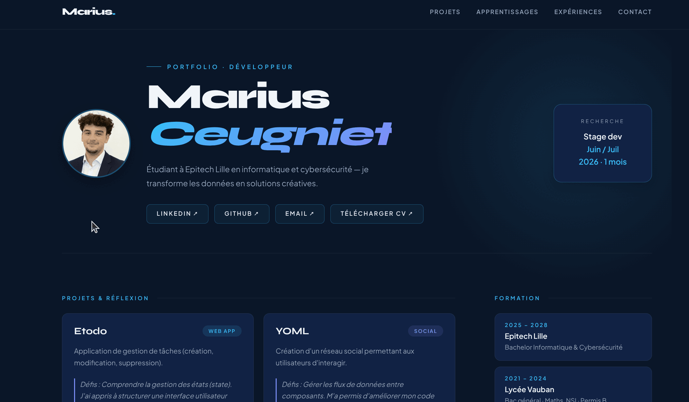

# 🌐 Mon Portfolio Personnel

Bienvenue sur le dépôt GitHub de mon portfolio en ligne ! C'est ici que je rassemble mon parcours, mes compétences et mes différents projets.

🔗 **Voir le site en direct :** [portfolio-ceugniet-marius.vercel.app](https://portfolio-ceugniet-marius.vercel.app/)

---

## 📸 Aperçu du site



---

## 🚀 À propos de moi

Moi c'est **Marius Ceugniet**. Actuellement étudiant à **Epitech Lille (Promo 2028)** en Bachelor Informatique & Cybersécurité, je me spécialise en **Développement Logiciel** avec un très fort intérêt pour l'**Intelligence Artificielle** et le **Machine Learning**.

Ce portfolio est ma vitrine pour partager mes créations, mon évolution technique et toutes mes expérimentations avec le code.

## 🛠️ Technologies utilisées

Pour développer et mettre en ligne ce site, j'ai utilisé :
- **Frontend :** React.js propulsé par Vite
- **Langages et Stylisme :** JavaScript, HTML5, CSS3
- **Déploiement :** [Vercel](https://vercel.com/)

## 📂 Contenu du projet

Le site est structuré en plusieurs sections :
- 🧑‍💻 **Accueil / Présentation :** Une vue globale de mon profil et de ma recherche actuelle (stage d'un mois en juin/juillet 2026).
- 💻 **Projets & Réflexion :** Une sélection de mes projets (Etodo, YOML, Hack And Juice, Chatbot & LLM) avec un retour sur mes défis et apprentissages.
- 📈 **Évolution :** Mon développement technique et mes activités au sein du Hub Epitech.
- 🎓 **Expériences & Formation :** Mon cursus académique, mes compétences et mes expériences professionnelles.
- ✉️ **Contact :** Mes réseaux (LinkedIn, GitHub), mon CV téléchargeable et un formulaire pour me joindre directement.

## ⚙️ Installation locale

Si tu souhaites lancer ce projet sur ta machine :

1. Clone le dépôt :
```bash
git clone https://github.com/klasken/Portfolio.git
```

2. Accède au dossier :
```bash
cd Portfolio
```

3. Installe les dépendances :
```bash
npm install
```

4. Lance le serveur de développement :
```bash
npm run dev
```

Le site sera accessible sur [http://localhost:5173](http://localhost:5173)
